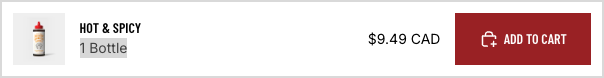

# PRD Lite: Sticky Add to Cart na stronę produktu

## 1. Podsumowanie

### Nazwa robocza

SnippetsHub Sticky Add to Cart Bar
snippetshub-sticky-add-to-cart-bar

### Typ rozwiązania

section + snippet + assets + inne pliki jeśli potrzebene

### Status

MVP

### Priorytet

wysoki

## 2. Cel biznesowy

### Problem

Na stronie produktu użytkownik po przewinięciu traci główny przycisk zakupu i najważniejsze informacje o produkcie, co obniża wygodę zakupu oraz liczbę dodań do koszyka, szczególnie na mobile.

### Cel

Utrzymać widoczne CTA zakupu i podstawowe informacje o produkcie podczas scrollowania, aby zwiększyć Add to Cart Rate i poprawić UX na stronie produktu.

### Główny KPI

Wzrost Add to Cart Rate na product page.

## 3. Użytkownik i kontekst użycia

### Dla kogo jest to rozwiązanie

Merchant Shopify, który chce szybko poprawić konwersję bez instalacji ciężkiej aplikacji.

### Gdzie działa

product page

### Moment użycia

Użytkownik przegląda kartę produktu, scrolluje w dół i nadal powinien mieć szybki dostęp do zakupu bez wracania do górnej części strony.

## 4. Zakres MVP

### Funkcje obowiązkowe

- wyświetlanie sticky bara po przewinięciu poniżej głównej sekcji zakupu,
- wyświetlanie sticky bara po przewinięciu poniżej przycisku add to cart,
- zdjęcia produktu, prezentacja nazwy produktu, prezentacja nazwy wariantu (jeśli jest), prezentacja ceny i głównego CTA,
- obsługa aktualnie wybranego wariantu,
- możliwość dodania produktu do koszyka z poziomu sticky bara,
- poprawne działanie na mobile i desktop.

### Funkcje opcjonalne

- pokazanie miniatury produktu,
- osobny tekst CTA konfigurowany w schema,
- możliwość ukrycia komponentu na desktop lub mobile.

### Poza zakresem

- zaawansowane animacje,
- bundle logic,
- upsell w sticky barze,
- integracje z aplikacjami zewnętrznymi.

## 5. Wymagania UX/UI

### Wygląd screen propozycja dla NVP

### Zachowanie rozwiązania

- komponent jest niewidoczny przy pierwszym widoku sekcji produktu,
- pojawia się po przewinięciu poza główny formularz zakupu,
- znika, gdy użytkownik wraca do górnej sekcji produktu,
- nie zasłania krytycznych elementów interfejsu,
- CTA jest czytelne i łatwe do kliknięcia na mobile.

### Responsive

- mobile: układ jednokolumnowy lub prosty dwukolumnowy z mocnym CTA,
- tablet: zachowanie pośrednie między mobile a desktop,
- desktop: kompaktowy pasek przyklejony do dolnej albo górnej krawędzi, w zależności od projektu.

### Edytowalność w Shopify

- merchant może zmienić kolory,
- merchant może zmienić tekst CTA,
- merchant może włączyć lub wyłączyć cenę, obrazek i nazwę produktu,
- merchant może ustawić pozycję paska lub widoczność na wybranych urządzeniach.

## 6. Wymagania techniczne

### Architektura

Lekkie rozwiązanie Shopify oparte o section, snippet i dedykowane assets CSS/JS. Bez frameworków i bez zewnętrznych bibliotek.

### Wymagania techniczne

- zgodność z Shopify Online Store 2.0,
- brak zbędnych zależności zewnętrznych,
- brak inline CSS,
- CSS w scope `.SnippetsHub`,
- nazewnictwo zgodne ze standardem SnippetsHub, plik (SnippetsHub/docs/SNIPPET_STANDARD.md)
- obsługa formularza produktu i aktualnego wariantu bez łamania natywnego flow motywu.

### Pliki, które mają powstać

- section z ustawieniami schema,
- snippet renderujący markup,
- plik CSS,
- plik JS,
- README,
- manifest,
- LICENSE.

### Integracje i zależności

- formularz produktu,
- aktualny wariant produktu,
- przycisk Add to Cart,
- cena produktu,
- opcjonalnie miniatura produktu.

## 7. Schema i ustawienia Shopify

### Ustawienia obowiązkowe

- tekst CTA,
- pokazuj cenę: tak lub nie,
- pokazuj nazwę produktu: tak lub nie,
- pokazuj nazwę warianty (dostępne tylko jeśli produkt ma wariant): tak lub nie,
- pokazuj miniaturę: tak lub nie,
- widoczność na mobile,
- widoczność na desktop,
- pozycja sticky bara,
- kolory tła i przycisku.

### Bloki

Na MVP bloki nie są wymagane.

### Domyślne wartości

- komponent aktywny,
- cena widoczna,
- nazwa produktu widoczna,
- nazwa warianty widoczna,
- miniatura ukryta,
- CTA: `Dodaj do koszyka`.

## 8. Treści i komunikacja

### Teksty w interfejsie

- ! zawsze przygotowujemy teksty w języku angielskim jako podstawa, później ewentualnie tłumaczymy na inne języki
- CTA: `Add to cart`
- komunikat opcjonalny: `Select variant`
- komunikat opcjonalny po błędzie: `Failed to add product to cart`

### Wersje językowe

EN jako wersja główna, z możliwością późniejszej lokalizacji.

## 9. Kryteria akceptacji

- sticky bar pojawia się dopiero po wyjściu poza główny obszar zakupu,
- sticky bar poprawnie dodaje do koszyka aktualnie wybrany wariant,
- komponent działa poprawnie na mobile i desktop,
- merchant może zarządzać podstawowymi ustawieniami przez schema,
- rozwiązanie nie używa inline CSS i pozostaje zgodne ze standardem SnippetsHub.

## 10. Ryzyka i ograniczenia

- różne motywy mogą mieć różne implementacje formularza produktu,
- synchronizacja wariantu może wymagać ostrożnej integracji z kodem motywu,
- zbyt duży sticky bar może pogarszać UX na małych ekranach.

## 11. Materiały sprzedażowe

### Czy przygotować dane do Shopify Product Listing Data

tak

### Jeśli tak, przygotować:

- tytuł produktu
- krótki opis
- pełny opis produktu
- ceny wariantów licencji
- tagi produktu
- SEO title
- meta description

## 12. Wdrożenie i testy

### Docelowy theme

- ! docelowy themes jest tylko do testów, nie jest to docelowy theme produkcyjny - docelowy theme produkcyjny będzie wybrany później
- Foldery szablonów do testów znajdują się w dolderze `SnippetsHub/themes-shopify/"... nazwa szablonu ..." -Demo` opisane jako `Demo`

### Co przetestować ręcznie

- wybór wariantu i dodanie do koszyka z poziomu sticky bara,
- zachowanie po przewijaniu w dół i w górę,
- widoczność na mobile i desktop,
- poprawność ceny i nazwy produktu,
- zachowanie przy produktach niedostępnych.

### Założenia robocze

- produkt korzysta ze standardowego formularza produktu Shopify,
- motyw ma dostęp do danych wariantu w sposób zgodny z OS 2.0,
- wersja MVP nie obsługuje niestandardowych bundle builderów.

### Założenia projektowe dla wdrożenia

- pracujemy w ekosystemie Shopify, gdzie formularze produktu i główne wzorce add to cart są w dużej mierze wspólne między szablonami,
- rozwiązanie rozwijamy jako snippet Shopify-first, bez wymyślania nowego flow tam, gdzie ekosystem Shopify ma już sprawdzone i wspierane wzorce,
- priorytetem jest kompatybilność z natywnym formularzem produktu, wariantami, ceną i mechaniką koszyka w standardowych motywach Shopify.

## 13. Definicja ukończenia

Zadanie uznajemy za ukończone, gdy:

- rozwiązanie jest gotowe technicznie,
- spełnia zakres MVP,
- jest zgodne ze standardem SnippetsHub,
- ma przygotowaną dokumentację,
- ma jasno opisane testy i założenia,
- nadaje się do dalszego opracowania jako produkt SnippetsHub.

## 14. Instalacja i użycie

### Instalacja w theme

1. Skopiować pliki `assets/`, `sections/` i `snippets/` tego rozwiązania do docelowego theme Shopify.
2. Otworzyć Theme Editor dla szablonu produktu.
3. Dodać sekcję `SNH Sticky Add to Cart`.
4. Skonfigurować widoczność, pozycję, kolory, zachowanie po add to cart oraz opcję ukrywania przy stopce.

### Podstawowe użycie

- Sticky bar powinien być używany na stronach produktu z natywnym formularzem Shopify.
- Domyślnie rozwiązanie stara się zachować użytkownika na stronie produktu po dodaniu do koszyka.
- Jeśli motyw ma własne zachowanie koszyka, merchant może użyć ustawienia `Use theme default behavior`.

### Weryfikacja po instalacji

- sprawdzić moment pojawiania się sticky bara po scrollu,
- sprawdzić zmianę wariantu i synchronizację ceny, obrazu oraz dostępności,
- sprawdzić add to cart na mobile i desktop,
- sprawdzić zachowanie komponentu przy zbliżeniu do stopki.
